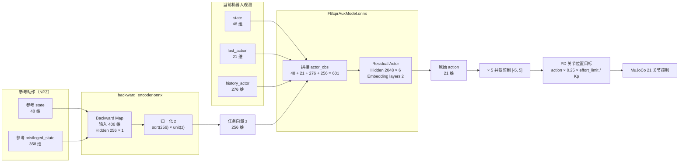

# Roban 训练与推理笔记

## FB 推理网络的输入、输出和结构

当前 `add_sim_delay_20260730_101320` 使用的是 `FBcprAuxModel`。推理时需要两个 ONNX：

| 文件 | 作用 | 输入 | 输出 |
| --- | --- | --- | --- |
| `backward_encoder.onnx` | 把参考动作编码成任务向量 | `state [B,48]`、`privileged_state [B,358]` | `z [B,256]` |
| `FBcprAuxModel.onnx` | 根据当前状态和任务向量产生控制动作 | `actor_obs [B,601]` | `action [B,21]` |

其中 `B` 是 batch size。单机器人实时推理时 `B=1`。

### 总体推理结构



### `state`：48 维

当前机器人和参考动作采用相同的 `state` 布局：

| 字段 | 维度 | 含义 |
| --- | ---: | --- |
| `dof_pos` | 21 | 21 个受控关节的位置 |
| `dof_vel` | 21 | 21 个受控关节的速度 |
| `projected_gravity` | 3 | 机身坐标系下的重力方向 |
| `base_ang_vel` | 3 | 机身坐标系下的基座角速度，训练 scale 为 `0.25` |
| 合计 | 48 | |

### `privileged_state`：358 维

它描述参考动作的全身 24 个 body：

| 字段 | 计算 | 维度 |
| --- | ---: | ---: |
| `root_height` | 基座高度 | 1 |
| `local_body_pos` | 去掉 root 后的 23 个 body，`23 × 3` | 69 |
| `local_body_rot` | 24 个 body 的 tangent-normal 旋转表示，`24 × 6` | 144 |
| `local_body_vel` | 24 个 body 的局部线速度，`24 × 3` | 72 |
| `local_body_ang_vel` | 24 个 body 的局部角速度，`24 × 3` | 72 |
| 合计 | | 358 |

这些量先去掉全局平移和 heading，再送入 backward encoder。因此 `z` 表示“要执行的参考动作/目标”，而不是机器人当前的绝对世界坐标。

### `history_actor`：276 维

历史观测保存以下 5 组数据的最近 4 帧：

```text
actions:             21 × 4 = 84
base_ang_vel:         3 × 4 = 12
dof_pos:             21 × 4 = 84
dof_vel:             21 × 4 = 84
projected_gravity:    3 × 4 = 12
合计                         276
```

实际内存顺序是按字段名排序后逐组展开：

```text
actions[4帧]
base_ang_vel[4帧]
dof_pos[4帧]
dof_vel[4帧]
projected_gravity[4帧]
```

不是把每一帧完整的 69 维观测连续拼接四次。

### 为什么 backward ONNX 没有 `last_action`

Backward Map 的配置只选择：

```python
key=["state", "privileged_state"]
```

它负责把参考状态编码成 `z`。参考动作数据没有对应的策略 `last_action`，所以不应该用它确定目标。代码构造参考观测时虽然会放入一个全零 `last_action` 作为统一字典接口的占位，但 backward input filter 会将它丢弃，ONNX 导出器也会自动删除这个无效输入。

`last_action` 只在 actor 中使用，用于让执行策略感知上一控制周期的动作、动作连续性和控制延迟。

因此两个 ONNX 的真实接口是：

```text
backward_encoder.onnx
  state             float32 [B, 48]
  privileged_state  float32 [B, 358]
  -> z              float32 [B, 256]

FBcprAuxModel.onnx
  actor_obs          float32 [B, 601]
  -> action          float32 [B, 21]
```

## 纯 ONNX + MuJoCo 推理

先由 backward ONNX 一次性生成部署 latent 和公共运行时清单：

```bash
cd /home/thl/wt_wbc/UFO

.venv/bin/python -m humanoidverse.generate_onnx_latent \
  --model-folder runs/new_onxx \
  --data-manifest configs/data/roban_s22_play.yaml \
  --dataset roban_lafan \
  --motion-id 0 \
  --reference-index 1 \
  --device cuda:0
```

该命令同时写入：

```text
runs/new_onxx/tracking_inference/zs_0.npy
runs/new_onxx/tracking_inference/metadata.json
```

Python 和 LEJULAB C++ 均读取这两个文件，不再读取 `zs_0.pkl`，也不再分别
维护 Actor、控制增益、动作缩放和 latent 帧语义。

该命令不加载 PyTorch checkpoint，也不构建训练环境：

```bash
cd /home/thl/wt_wbc/UFO

.venv/bin/python -m humanoidverse.onnx_mujoco_sim \
      --model-folder runs/new_onxx \
  --motion humanoidverse/data/roban/named_roban_lafan/aiming1_subject1.npz \
  --scene humanoidverse/data/robots/biped_s17/xml/scene_fixedheadjoint.xml
```

Scene XML 负责加载机器人、地面、灯光、天空和材质；推理代码不再动态创建地面。窗口中实体机器人由 ONNX 控制，侧面的半透明绿色机器人显示参考动作。

### 快捷 Shell 脚本

直接使用默认 checkpoint 和动作：

```bash
cd /home/thl/wt_wbc/UFO
./run_onnx_mujoco.sh
```

快速指定模型目录和动作 NPZ：

```bash
./run_onnx_mujoco.sh \
  runs/add_sim_delay_20260730_101320 \
  humanoidverse/data/roban/named_roban_lafan/aiming1_subject1.npz
```

前两个位置参数之后可以继续传入 Python 入口支持的选项：

```bash
# 无窗口短测
./run_onnx_mujoco.sh --headless --max-steps 500

# 修改参考机器人的横向距离
./run_onnx_mujoco.sh --reference-offset-y 0.8

# 不显示参考机器人
./run_onnx_mujoco.sh --no-reference
```

比较 CPU 和 CUDA 的 ONNX 网络推理速度：

```bash
./run_onnx_mujoco.sh \
  --benchmark \
  --benchmark-warmup 100 \
  --benchmark-iterations 1000
```

正常播放默认使用 CPU ONNX；可以切换成 CUDA：

```bash
./run_onnx_mujoco.sh --onnx-provider cuda
```

将 MuJoCo 和 ONNX Actor 拆成两个进程，并打印纯推理与 IPC 往返延迟：

```bash
./run_onnx_mujoco.sh \
  --inference-mode process \
  --onnx-provider cpu \
  --latency-log-every 100
```

复现 LEJULAB 的单线程 ONNX Runtime 配置：

```bash
./run_onnx_mujoco.sh \
  --inference-mode process \
  --onnx-provider cpu \
  --onnx-threads 1 \
  --latency-log-every 100
```

同进程模式也会打印 Actor 延迟，便于直接对照：

```bash
./run_onnx_mujoco.sh --inference-mode inline --latency-log-every 100
```

也可以通过环境变量覆盖默认值：

```bash
UFO_PYTHON=.venv/bin/python \
UFO_ONNX_MODEL_FOLDER=runs/add_sim_delay_20260730_101320 \
UFO_ONNX_MOTION=humanoidverse/data/roban/named_roban_lafan/aiming1_subject1.npz \
./run_onnx_mujoco.sh
```
